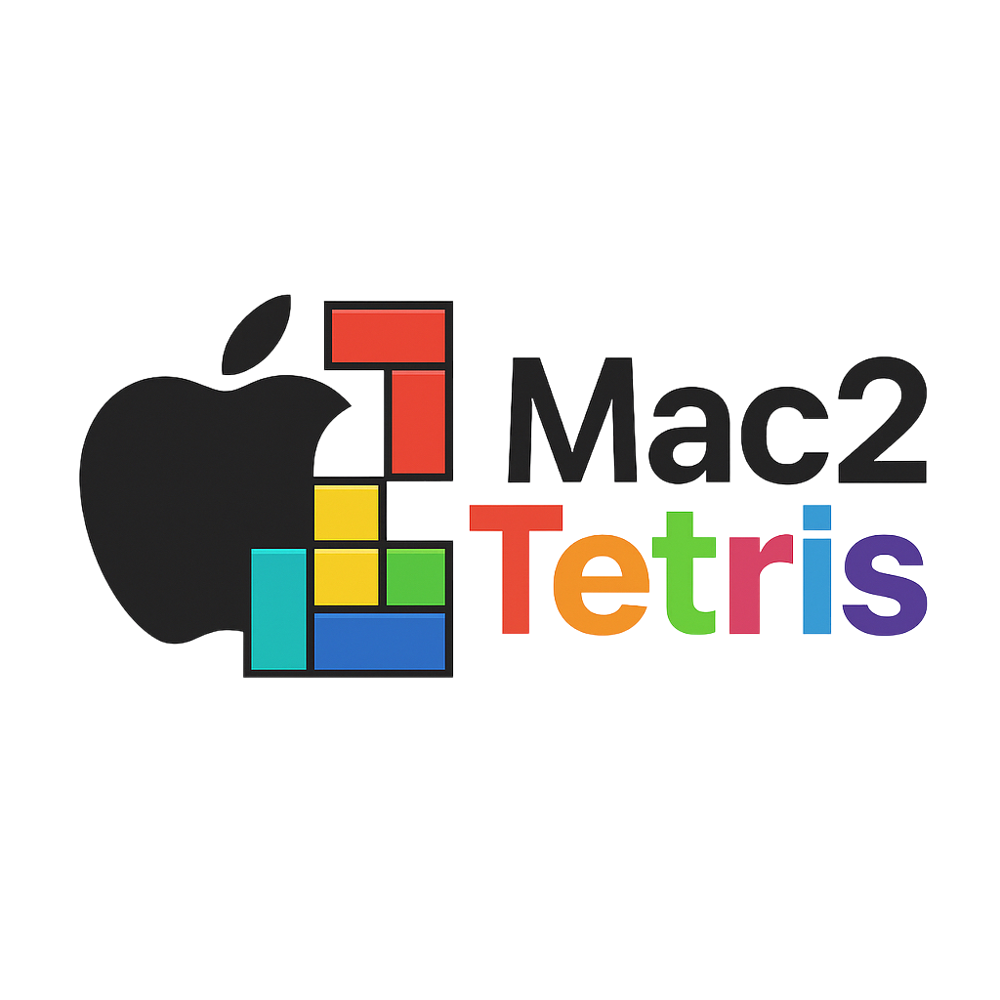

<p align="center">
  
</p>

## 🚀 Installation & Setup Instructions

### **Step 1:**
Place the `utils` folder inside your `nand2tetris/tools` directory.

---

### **Step 2:**
Create a custom **Automator app**:
1. Open the **Automator** app (pre-installed on macOS).
2. Click **New Document → Application**.
3. Use the search bar to find **Run AppleScript**, then drag it into the workflow pane.
4. Copy the contents of `./utils/AppleScript.rtf` into the AppleScript editor.
5. Save the file as `mac2tetris.app` inside the `nand2tetris/tools` directory.

---

### **Step 3:**
Remove macOS security restrictions by running:
```bash
xattr -d com.apple.quarantine utils/script.sh
```

---

### **Step 4:**
Double-click `mac2tetris.app`.  
It will automatically generate `.app` files for all **Nand2Tetris simulators**.

---

### **Step 5 (Optional):**
Once the process is complete, you can safely delete:
```
utils/
mac2tetris.app
```

---

## 💻 Enjoy the Convenience
You can now launch your **Nand2Tetris simulators** directly with a **simple double-click** or even from **Spotlight search** — no more terminal commands required!

---

<p align="center">
  <b>Created by:</b> Neriah Ben David
</p>
